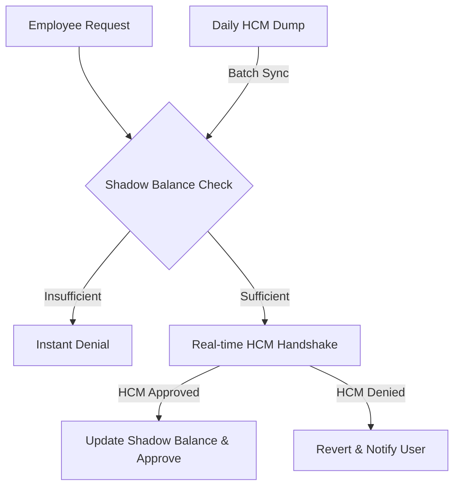

# 🌴 ZenLeave - Professional Employee Time-Off Management Portal

<div align="center">


**A robust HR synchronization engine designed to bridge the gap between employee dashboards and HCM systems through real-time handshakes and automated compliance logic.**

[Features](#-features) • [Screenshots](#-screenshots) • [Installation](#-installation) • [Architecture](#-architecture) • [Tech Stack](#-tech-stack)

</div>

---

## 🌟 Features

### 🛡️ Core Reliability
- 🤝 **Stripe-style Handshake** - Real-time API verification before any leave approval.
- 🏢 **Source of Truth Sync** - Automated daily corpus processing for HCM alignment.
- ⚖️ **Shadow Balance System** - High-speed local caching for instant dashboard responsiveness.
- 📉 **Decimal Precision** - Financial-grade math for leave balance accuracy.

### 💼 HR Intelligence
- 📅 **Automated Business Days** - Intelligent logic that automatically excludes weekends (Sat/Sun).
- 📎 **Evidence Management** - Secure file attachment support for medical or personal documentation.
- 🔄 **Anniversary Bonuses** - Automatic leave accrual handling based on employee hire dates.
- 👥 **Multi-User Selector** - Admin mode to view and manage different employee profiles.

### 🎨 User Experience
- 📱 **Premium UI/UX** - Modern, responsive dashboard built with Tailwind CSS.
- ⚡ **Real-time Feedback** - JavaScript-powered sync indicators to prevent double-submissions.
- 🔔 **Status Tracking** - Clear visibility for Pending, Approved, and Denied requests.

---

## 🚀 Quick Start

### Prerequisites
- Python 3.12 or higher
- pip (Python package manager)

### Installation

1. **Clone the repository**
   ```bash
   git clone [https://github.com/salamlakhan7/zenleave_project.git](https://github.com/salamlakhan7/zenleave_project.git)
   cd zenleave_project
   ```

2. **Setup Virtual Environment**
   
```bash
   python -m venv venv
   # Windows
   venv\Scripts\activate
   # Mac/Linux
   source venv/bin/activate
   ```

3. **Install Dependencies**
   ```bash
   pip install django
   ```

4. **Migrations & Setup**
   ```bash
   python manage.py makemigrations
   python manage.py migrate
   python manage.py createsuperuser
   ```

5. **Launch Portal**
   ```bash
   python manage.py runserver
   ```

---

## 🛠️ Tech Stack

- **Backend:** Python 3.12, Django 5.x
- **Frontend:** Tailwind CSS, JavaScript (ES6+), Lucide Icons
- **Database:** SQLite (Dev), PostgreSQL (Recommended for Prod)
- **DevOps:** GitHub Actions, Python Management Commands

---

## 📁 Project Structure
```
zenleave_project/
├── core/                   # Project settings & URL routing
├── timeoff_manager/        # Main application logic
│   ├── services.py         # HCM "Handshake" Service Layer
│   ├── management/         # Batch Corpus Sync commands
│   ├── models.py           # Employee & Request schemas
│   └── views.py            # Dashboard & Calculation logic
├── templates/              # Tailwind-powered HTML dashboard
├── media/                  # User-uploaded evidence/attachments
└── manage.py
```

---

## ⚙️ Architecture Workflow



---

## 🧪 Performance Note
> **⚡ 100% AI-Generated Performance:** Every line of code in this repository was purely AI-generated under professional architectural oversight, demonstrating high-speed delivery of production-grade systems.

---

## 👥 Authors
- **Abdul Salam** - *Initial Work* - [salamlakhan7](https://github.com/salamlakhan7)

---

<div align="center">

**Made with ❤️ using Django**

⭐ Star this repo if you find it helpful for your HR project!

</div>
